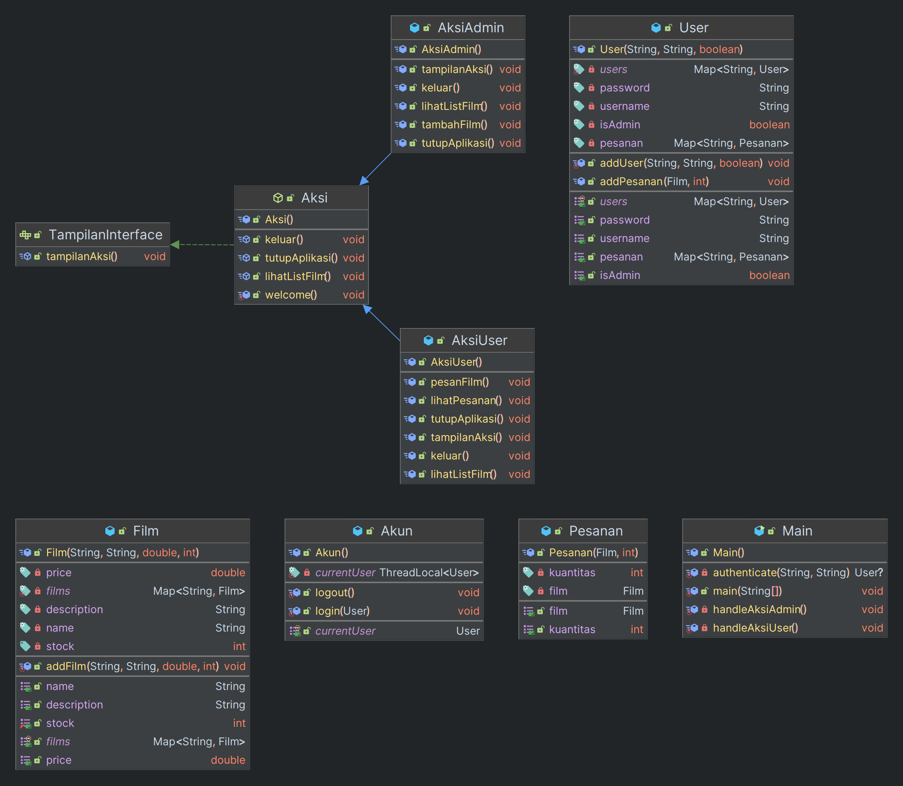

# Studi Kasus: Aplikasi Pemesanan Tiket Bioskop
## Deskripsi

Anda diminta untuk membuat sebuah aplikasi pemesanan tiket film berbasis terminal. Aplikasi ini memiliki dua peran utama: user dan admin. Berikut adalah rincian fitur yang harus ada dalam aplikasi:

## Fitur untuk User:
- Login: User dapat login ke dalam sistem menggunakan username dan password.
- Pesan Film: User dapat memesan tiket untuk film yang tersedia. User harus memasukkan jumlah tiket yang ingin dipesan.
- Lihat Pesanan: User dapat melihat daftar film yang sudah dipesan sebelumnya.
- Lihat Daftar Film: User dapat melihat daftar film yang tersedia beserta deskripsinya.
- Logout: User dapat logout dari sistem.
- Tutup Aplikasi: User dapat menutup aplikasi.
## Fitur untuk Admin:
- Login: Admin dapat login ke dalam sistem menggunakan username dan password.
- Tambah Film: Admin dapat menambahkan film baru ke dalam sistem dengan memasukkan nama film, deskripsi singkat, harga tiket, dan stok tiket.
- Lihat Daftar Film: Admin dapat melihat daftar film yang tersedia beserta deskripsinya.
- Logout: Admin dapat logout dari sistem.
- Tutup Aplikasi: Admin dapat menutup aplikasi.

Jika stok tiket untuk suatu film habis, maka film tersebut tidak dapat dipesan oleh user lagi.

## Struktur Kelas
Diagram berikut menunjukkan struktur kelas yang digunakan dalam aplikasi ini:

